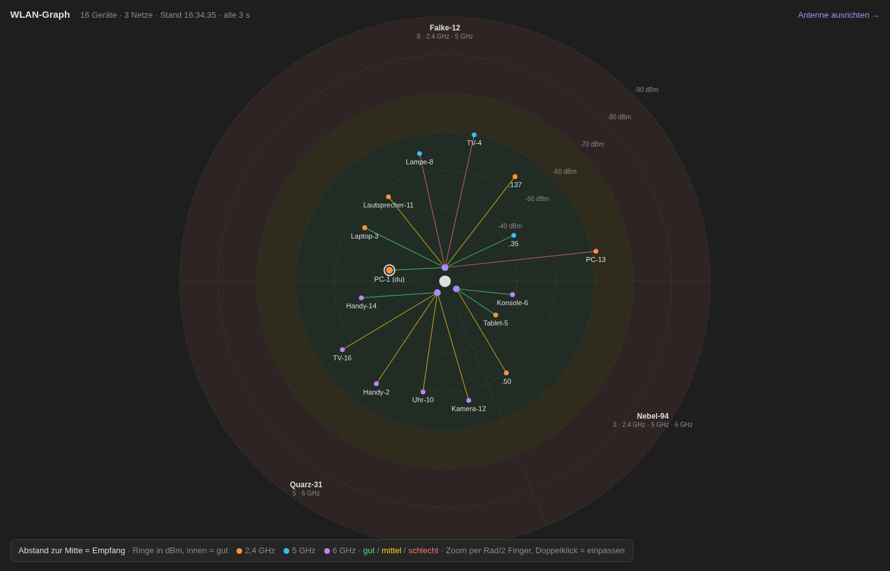

<div align="center">


# omarchy-wlan-tools

**Ein kleiner Werkzeugkasten, um herauszufinden, warum das WLAN laggt: Antennen ausrichten, Live-Radar aller Geräte, Paketverlust, Gerätetests und ein A/B-Test Wi-Fi 6E gegen 7.**
Für [Omarchy](https://omarchy.org) / jedes Linux mit `iw`.

[](README.md)

</div>

---


*`wlan-graph --demo`: erfundene Geräte und zufällige Netznamen*

## Die Werkzeuge

| Befehl | Starter | Was es macht | Router-SSH nötig |
|---|---|---|---|
| `antenne` | WLAN Antenne | Punktzahl für die PC-Antennen im Terminal: PHY-Rate, Ströme, dBm je Antenne, MCS-Verlauf ([eigenes Repo](https://github.com/vsvito420/omarchy-antenne)) | nein |
| `wlan-graph` | WLAN Graph | Web-Radar aller Geräte am Router: Abstand zur Mitte = Empfang, ein Sektor je Netz, Farbe = Band | ja |
| `wlan-graph --ausrichten` | WLAN Antenne ausrichten | **Router**-Antennen ausrichten: Kerze je Position, besser/schlechter als vorher (fair: nur Geräte, die in beiden da waren), Topscore | ja |
| `wlan-graph --lan` | – | Dieselbe Seite fürs Handy im Heimnetz (geheimer Link + QR-Code, Port 8775) | ja |
| `wlan-loss` | WLAN Paketverlust | Paketverlust und Lag-Spitzen live: Router, Provider, Valve-CS2-Relay und 1.1.1.1 nebeneinander, WLAN-Scans und Router-Wiederholungen markiert, CSV-Log | optional |
| `wlan-test [ip\|name\|mac]` | WLAN Gerätetest | Einmaltest eines Geräts: Pings hin, Router-Zähler vorher/nachher → Wiederholungen und Verlust in beide Richtungen | ja |
| `wlan-vergleich` | WLAN Vergleich 6E/7 | Fairer A/B-Test Wi-Fi 6E gegen Wi-Fi 7 (Intel BE200, `disable_11be`): Ping, Jitter, Speed zu einem Server per Kabel, Empfehlung | ja + Server |
| `wifimon` | WLAN Router-Monitor | Live-Signalmonitor für diesen PC, läuft auf dem Router (`router/wifimon.sh`) | ja |

## Installieren

```bash
git clone https://github.com/vsvito420/omarchy-wlan-tools
cd omarchy-wlan-tools
./install.sh            # fragt einmal Router-Adresse / SSH-Benutzer / Port
wlan-graph --demo       # ohne Router ausprobieren
```

Einstellungen: `~/.config/wlan-tools/config` (siehe [`config.example`](config.example)), ohne Datei wird das Standard-Gateway genommen.
Logs landen in `~/.local/state/wlan-*`. Entfernen mit `./uninstall.sh`.

## Voraussetzungen

- Python 3 (nur Standardbibliothek), `iw`, `iproute2`, `ping`, `ssh`; `qrencode` optional für `--lan`
- Für die Router-Tools: **ASUS-Router mit Qualcomm-WLAN** (`wlanconfig`, `apstats`, `ath*`), SSH mit Schlüssel-Login
- `wifimon`: `router/wifimon.sh` auf den Router kopieren (z. B. `/jffs/wifimon.sh`)
- `wlan-vergleich`: Intel-Wi-Fi-7-Karte (iwlwifi), sudo und ein Linux-Rechner per Kabel mit `python3` und SSH-Schlüssel (`SERVER=` in der Config)
- `wlan-graph --lan`: Port 8775 fürs Heimnetz freigeben, z. B. `sudo ufw allow from 192.168.1.0/24 to any port 8775 proto tcp`

## So funktioniert's

- Router-Daten kommen pro Aktualisierung aus einem SSH-Aufruf (`ControlMaster` hält die Verbindung offen): `iwconfig` je `ath*`, `wlanconfig list sta`, dnsmasq-Leases, ARP.
- Wi-Fi-7-MLO-Geräte melden eine zufällige Link-Adresse; `wlan-graph` ordnet sie über die Zeile `MLD Addr` der echten MAC zu.
- `wlan-graph` liefert eine HTML-Seite von einem Mini-Server (127.0.0.1:8765), öffnet sie als Omarchy-Web-App und beendet sich nach 45 s ohne Abruf.
- `wlan-test` liest `apstats -v -i <vap> -R` vor und nach einer Ping-Serie, dadurch klappt es auch, wenn ein Gerät auf zwei Bändern gelistet ist.

## Lizenz

MIT · Deutsch & English
